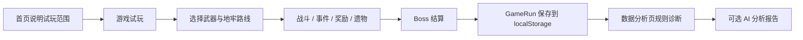

# Project Summary

## 项目背景

《灵墟地牢》面向 AI 游戏岗位校招面试，展示一个从网页试玩、玩法验证到数据调优的第一关 Roguelite 闭环。当前线上试玩入口聚焦首页、游戏试玩和数据分析；AI Designer 与 Asset Forge 代码仍保留在项目内，但不作为当前公开试玩入口。

## 目标用户

游戏策划、运营、内容编辑、美术、独立开发者。

## 痛点

- 关卡内容生产慢。
- 美术资源成本高。
- 数值配置验证慢。
- 缺少试玩数据反馈。

## 解决方案

- 第一关试玩闭环：遗迹猎人、四种武器、6-8 房间随机路线、事件、遗物和 Boss 结算。
- 数据闭环：GameRun 保存到 localStorage，数据分析页展示通关率、角色胜率、失败原因和最近对局。
- AI 可选接入：有 API key 时生成分析报告，没有 key 时使用 mock / 规则 fallback。
- 工具链保留：AI Designer 与 Asset Forge 可继续用于内部开发和后续扩展。

## 项目流程图

## 核心模块

- Home：说明当前第一关试玩范围、版本状态和推荐演示顺序。
- Game：第一关俯视角动作 Roguelite，包含武器选择、6-8 房间路线、战斗、事件、奖励、遗物和 Boss 结算。
- Analytics：读取 localStorage 对局数据，输出体验评分、失败原因、角色胜率、最近对局和可选 AI 分析报告。
- AI Designer：生成、编辑、校验、导入导出和应用关卡 JSON；当前线上试玩隐藏入口。
- Asset Forge：程序化生成可用 SVG 资源，提供 Blender 低模扩展脚本；当前线上试玩隐藏入口。

## 后续扩展

整理实验分支中稳定的小修补进入正式版本，继续完善结算与数据分析一致性、localStorage 脏数据兜底、试玩流程可读性，再逐步考虑更多职业、遗物组合、自动化 Bot 压测和可视化地图编辑器。
