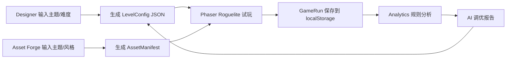

# Project Summary

## 项目背景

AI Dungeon Forge 面向 AI 游戏岗位校招面试，展示一个从内容生成、资源生产、玩法验证到数据调优的完整游戏生产闭环。

## 目标用户

游戏策划、运营、内容编辑、美术、独立开发者。

## 痛点

- 关卡内容生产慢。
- 美术资源成本高。
- 数值配置验证慢。
- 缺少试玩数据反馈。

## 解决方案

- AI 生成关卡配置。
- 程序化生成美术资源。
- JSON 驱动游戏。
- 玩家数据记录。
- AI 分析调优。

## 项目流程图

## 核心模块

- Game：三层房间制 Roguelite，包含探索、战斗、事件、装备、遗物、Boss。
- AI Designer：生成、编辑、校验、导入导出和应用关卡 JSON。
- Asset Forge：程序化生成可用 SVG 资源，提供 Blender 低模扩展脚本。
- Analytics：读取对局数据，输出体验评分和调优建议。

## 后续扩展

接入真实图像生成 API、自动化 Bot 压测、在线关卡分享、更多职业和遗物组合、可视化地图编辑器。
